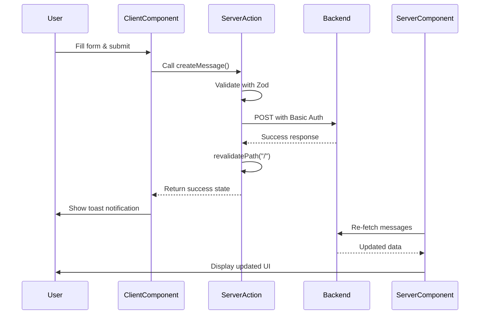

## Application Architecture

This project is built with **Next.js 15** using the App Router architecture, which provides a modern, file-based routing system with built-in support for Server Components and Server Actions.

## Folder Structure

The application follows Next.js 15 conventions with a clear separation of concerns:

```
src/
├── app/
│   ├── layout.tsx          # Root layout with fonts and metadata
│   ├── page.tsx            # Home page (Server Component)
│   └── globals.css         # Global styles
├── components/
│   ├── Messages.tsx        # Server Component for messages
│   ├── People.tsx          # Server Component for people
│   ├── CreateMessageForm.tsx  # Client Component for forms
│   └── ui/                 # shadcn/ui components
├── lib/
│   └── actions/
│       ├── message/        # Message-related server actions
│       ├── people/         # People-related server actions
│       └── reschedule/     # Reschedule server actions
```

<Note>
The `app/` directory contains routes and layouts, `components/` contains reusable UI components, and `lib/actions/` contains all server-side business logic.
</Note>

## Server vs Client Components

### Server Components (Default)

By default, all components in Next.js 15 are Server Components. They run on the server and have access to backend resources.

**Example from** `src/app/page.tsx:9-24`:

```tsx
export default async function page() {
  if (!process.env.BACKEND_URL) {
    return <p>Backend URL not found</p>;
  }
  let data;
  try {
    const response = await fetch(`${process.env.BACKEND_URL}/time-left`, {
      method: "GET",
    });
    data = await response.json();
    if (response.status != 200) {
      <div className="h-screen grid place-items-center">
        <h1 className="font-bold text-4xl">Backend Cannot Be Accessed</h1>
      </div>;
    }
  } catch (e) {
    // Error handling...
  }
}
```

**Benefits:**
- Direct access to environment variables
- Can fetch data directly from APIs
- Zero JavaScript sent to the client
- Improved performance and SEO

**Example from** `src/components/Messages.tsx:28-39`:

```tsx
export default async function Messages() {
  const data = await fetch(`${process.env.BACKEND_URL}/messages/all`, {
    headers: {
      Authorization: `Basic ${Buffer.from(
        `${process.env.USERNAME}:${process.env.PASSWORD}`
      ).toString("base64")}`,
    },
  });
  if (!data.ok) {
    notFound();
  }
  const messages = await data.json();
  // Render messages...
}
```

### Client Components

Client Components are marked with `"use client"` directive and run in the browser. They're needed for interactivity.

**Example from** `src/components/CreateMessageForm.tsx:1-25`:

```tsx
"use client";

import { useActionState, useEffect } from "react";
import createMessage from "@/lib/actions/message/createMessage";

export default function MessageUpdateForm({ people }: { people: People[] }) {
  const [createState, createAction, createIsPending] = useActionState(
    createMessage,
    {}
  );
  
  useEffect(() => {
    if (createState.success) {
      toast.success("Message created successfully", {
        richColors: true,
      });
    }
  }, [createState]);

  return (
    <form action={createAction} className="space-y-3 flex flex-col">
      {/* Form fields */}
    </form>
  );
}
```

<Warning>
Client Components cannot directly access server-only APIs like environment variables or databases. Use Server Actions to bridge this gap.
</Warning>

## Data Flow Architecture

The application follows a unidirectional data flow pattern:

<Steps>
  <Step title="User Interaction">
    User fills out a form in a Client Component (e.g., `CreateMessageForm.tsx`)
  </Step>
  
  <Step title="Server Action Invocation">
    Form submission triggers a Server Action using `useActionState` hook
  </Step>
  
  <Step title="Backend Communication">
    Server Action validates data, authenticates, and communicates with Bun/Hono backend
  </Step>
  
  <Step title="Cache Revalidation">
    Server Action calls `revalidatePath("/")` to refresh cached data
  </Step>
  
  <Step title="UI Update">
    Server Components re-fetch and display updated data automatically
  </Step>
</Steps>

### Complete Data Flow Example



## Dynamic Rendering

The home page uses dynamic rendering to ensure fresh data on every request:

**From** `src/app/page.tsx:7`:

```tsx
export const dynamic = 'force-dynamic';
```

<Note>
This ensures the page is never statically generated and always fetches fresh data from the backend.
</Note>

## Component Composition

The application uses a nested component structure:

<Accordion title="Root Layout (layout.tsx)">
Defines the HTML structure, fonts, and global providers like the Toaster for notifications.

```tsx
export default function RootLayout({ children }: { children: React.ReactNode }) {
  return (
    <html lang="en">
      <body className={`${geistSans.variable} ${geistMono.variable} ${archivo.variable} antialiased`}>
        <Toaster />
        {children}
      </body>
    </html>
  );
}
```
</Accordion>

<Accordion title="Page Component (page.tsx)">
Fetches initial data and composes the main UI with Messages, People, and Rescheduler components.

```tsx
export default async function page() {
  const response = await fetch(`${process.env.BACKEND_URL}/time-left`);
  const data = await response.json();
  
  return (
    <div className="container p-5 mx-auto max-w-5xl">
      <div className="grid grid-cols-1 md:grid-cols-3 gap-2 pt-2">
        <Messages />
        <People />
      </div>
    </div>
  );
}
```
</Accordion>

<Accordion title="Feature Components (Messages.tsx, People.tsx)">
Server Components that fetch their own data and compose Client Components for forms.

```tsx
export default async function Messages() {
  const messages = await fetch(`${process.env.BACKEND_URL}/messages/all`);
  
  return (
    <div>
      <ScrollArea>
        {messages.map(message => <Message key={message.id} message={message} />)}
      </ScrollArea>
      <Dialog>
        <CreateMessageForm people={people} />
      </Dialog>
    </div>
  );
}
```
</Accordion>

## Key Architectural Patterns

<CardGroup cols={2}>
  <Card title="Server-First" icon="server">
    Default to Server Components for better performance and direct backend access
  </Card>
  
  <Card title="Progressive Enhancement" icon="bolt">
    Use Client Components only where interactivity is needed
  </Card>
  
  <Card title="Colocation" icon="folder-tree">
    Keep related server actions grouped by feature in `lib/actions/`
  </Card>
  
  <Card title="Type Safety" icon="shield">
    Use TypeScript interfaces and Zod schemas for runtime validation
  </Card>
</CardGroup>

## Next Steps

<CardGroup cols={2}>
  <Card title="Server Actions" icon="bolt" href="/concepts/server-actions">
    Learn how to implement server-side business logic
  </Card>
  
  <Card title="Authentication" icon="lock" href="/concepts/authentication">
    Understand the Basic Auth pattern used in this app
  </Card>
</CardGroup>